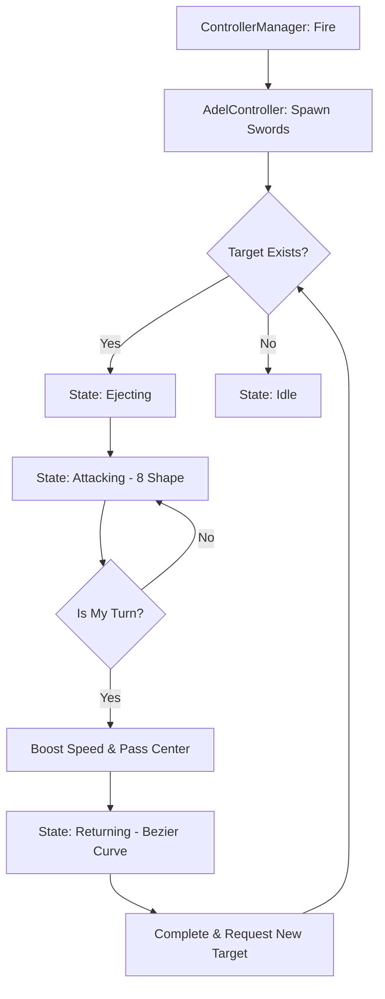

# AdelFlyingSword 시스템 분석 보고서

이 문서는 **SwordLordMaker** 프로젝트의 핵심 공격 시스템 중 하나인 **AdelFlyingSword**의 설계, 동작 원리 및 구현 세부 사항을 기술합니다.

---

## 1. 개요 (Overview)

**AdelFlyingSword**는 무한대(∞) 기호 모양의 8자 궤도(**Gerono Lemniscate**)를 그리며 비행하는 검 시스템입니다. 플레이어 주변에서 사출되어 적을 추적하며, 여러 개의 검이 턴(Turn)을 나누어 순차적으로 가속 공격을 가하는 전략적인 메커니즘을 가지고 있습니다.

- **주요 특징**: 8자 궤도 비행, 턴 기반 가속 시스템, 베지에 곡선 복귀, BigInteger 기반 데미지 스케일링.

---

## 2. 아키텍처 (Architecture)

### 2.1 상속 계층 구조
시스템은 확장성과 유지보수를 위해 추상 클래스를 기반으로 설계되었습니다.

- **`BaseFlyingSword`**: 모든 비행 검의 공통 기능(데미지 처리, 높이 제한 등)을 정의합니다.
- **`AdelFlyingSword`**: 8자 궤도 이동 로직과 상태 머신을 구현합니다.
- **`BaseSwordController`**: 검 생성 및 타겟팅의 공통 인터페이스를 제공합니다.
- **`AdelFlyingSwordController`**: Adel 검들의 턴 관리 및 스폰을 담당합니다.

### 2.2 파일 구조
```
Assets/
└── DamageFloater/
    └── 01.Scripts/
        ├── Adel/
        │   ├── AdelFlyingSword.cs           # 개별 검의 AI 및 이동
        │   └── AdelFlyingSwordController.cs # 검 그룹 관리 및 턴 제어
        ├── BaseFlyingSword.cs               # 비행 검 기반 클래스
        ├── BaseSwordController.cs           # 컨트롤러 기반 클래스
        └── Manager/
            └── ControllerManager.cs         # 전체 검 시스템 싱글톤
```

---

## 3. 동작 원리 (Working Principles)

### 3.1 상태 머신 (State Machine)
`AdelFlyingSword`는 4가지 상태를 가집니다.

| 상태 | 설명 | 전환 조건 |
|------|------|----------|
| **Ejecting** | 생성 직후 지정된 방향으로 튕겨 나감 | 속도가 일정 수준 이하로 감소 시 |
| **Attacking** | 타겟 주위에서 8자 궤도를 그리며 비행 | 타겟 소멸 또는 범위 이탈 시 Idle 전환 |
| **Returning** | 공격 1주기 완료 후 플레이어에게 복귀 | 플레이어 근처 도달 시 완료 |
| **Idle** | 타겟이 없을 때 플레이어 주변을 원형 비행 | 유효 타겟 발견 시 Attacking 전환 |

### 3.2 궤도 알고리즘 (Gerono Lemniscate)
8자 궤도는 수학적으로 **게로노의 레므니스케이트** 공식을 3D XZ 평면에 적용하여 구현됩니다.

**수학 공식:**
$$x = A \cdot \sin(t)$$
$$z = \frac{A}{2} \cdot \sin(2t)$$

**코드 구현:**
```csharp
float x = Mathf.Sin(_time) * CurveScale;
float z = Mathf.Sin(2f * _time) * (CurveScale * 0.5f);
Vector3 localPos = new Vector3(x, 0, z);
```
- `CurveScale`: 궤도의 크기를 결정합니다.
- `_time`: 시간에 따라 증가하며 위치를 결정합니다. 공격 턴일 때 증가 속도가 빨라집니다.

### 3.3 턴 기반 공격 시스템 (Turn-based Attack)
`AdelFlyingSwordController`는 활성화된 검들 중 하나를 `CurrentAttacker`로 지정합니다.

1. **가속**: 자신의 턴인 검이 타겟에 근접하면 `AttackBoostSpeed`를 사용하여 빠르게 궤도를 돕니다.
2. **턴 교체**: 검이 타겟의 중심을 통과(`CheckCenterPass`)하면 다음 검에게 턴을 넘기고 자신은 `Returning` 상태가 됩니다.
3. **순환**: 모든 검이 순차적으로 공격하여 끊임없는 타격감을 제공합니다.

---

## 4. 컨트롤러 시스템 (Controller System)

### 4.1 ControllerManager (Singleton)
전체 시스템의 중앙 제어 장치로, 현재 활성화된 검 모드(Adel, Hypo, Pixel)를 관리합니다.
- `SwitchMode(SwordType.Adel)`을 통해 실시간 모드 전환 지원.
- `Fire()` 메서드로 검 사출 명령 하달.

### 4.2 AdelFlyingSwordController의 역할
- **검 생성**: `SpawnDualSwords()`를 통해 한 번에 2자루씩, 최대 `MaxSwordCount`까지 생성.
- **턴 관리**: `_currentAttackerOrderIndex`를 통해 공격 순서 제어.
- **타겟팅**: 플레이어 거리 기준 가장 가까운 적을 탐색하여 검들에게 할당.

---

## 5. 전투 시스템 (Combat System)

### 5.1 타겟팅 및 충돌 감지
- **타겟팅**: `MaxTargetDistance` 내의 적을 `FindGameObjectsWithTag("Enemy")`로 탐색.
- **충돌**: `OnTriggerEnter`를 통해 적의 `IDamageable` 인터페이스를 호출.

### 5.2 데미지 계산 (BigInteger)
방치형 게임의 특성상 수치가 기하급수적으로 증가하므로 `System.Numerics.BigInteger`를 사용합니다.

```csharp
public BigInteger CalculateDamage(bool isCrit)
{
    if (!isCrit) return AttackDamage;
    return new BigInteger((double)AttackDamage * CritDamageMultiplier);
}
```
- `SwordStat`: `record` 타입을 사용하여 데이터 불변성을 보장.
- **데미지 플로터 연동**: `DamageFloaterManager`를 통해 타격 지점에 데미지 텍스트를 출력합니다.

---

## 6. 이벤트 및 최적화

### 6.1 이벤트 통신 (Observer 패턴)
- `UpgradeManager.OnUpgraded` 이벤트를 구독하여 공격력, 이동 속도 등 스탯 강화 시 실시간으로 활성화된 모든 검에 적용합니다.

### 6.2 최적화 (Optimization)
- **타겟 재탐색 주기**: 매 프레임 타겟을 찾지 않고 `SearchInterval` (0.2초) 마다 실행하여 CPU 부하를 줄입니다.
- **ClampHeight**: 검이 지면 아래로 파묻히는 것을 방지하기 위해 `MinHeight` 보정 로직을 포함합니다.
- **SmoothDamp**: 급격한 위치 변화를 방지하고 부드러운 움직임을 위해 `Vector3.SmoothDamp`를 사용합니다.

---

## 7. 주요 파라미터 설명

| 변수명 | 의미 | 기본값 |
|--------|------|-------|
| `CurveScale` | 8자 궤도의 전체적인 크기 | 10.0 |
| `PatrolSpeed` | 기본 비행 속도 | 2.5 |
| `AttackBoostSpeed` | 공격 턴 시 가속되는 속도 | 23.8 |
| `MaxSwordCount` | 동시 활성 가능한 최대 검 개수 | 6 |
| `SpawnForce` | 사출 시 튕겨 나가는 힘 | 10.0 |
| `ReturnArriveThreshold` | 복귀 완료로 간주하는 거리 | 5.0 |

---

## 8. 시스템 흐름도 (Visualization)



---

*본 문서는 SwordLordMaker 기술 사양을 바탕으로 작성되었습니다.*
