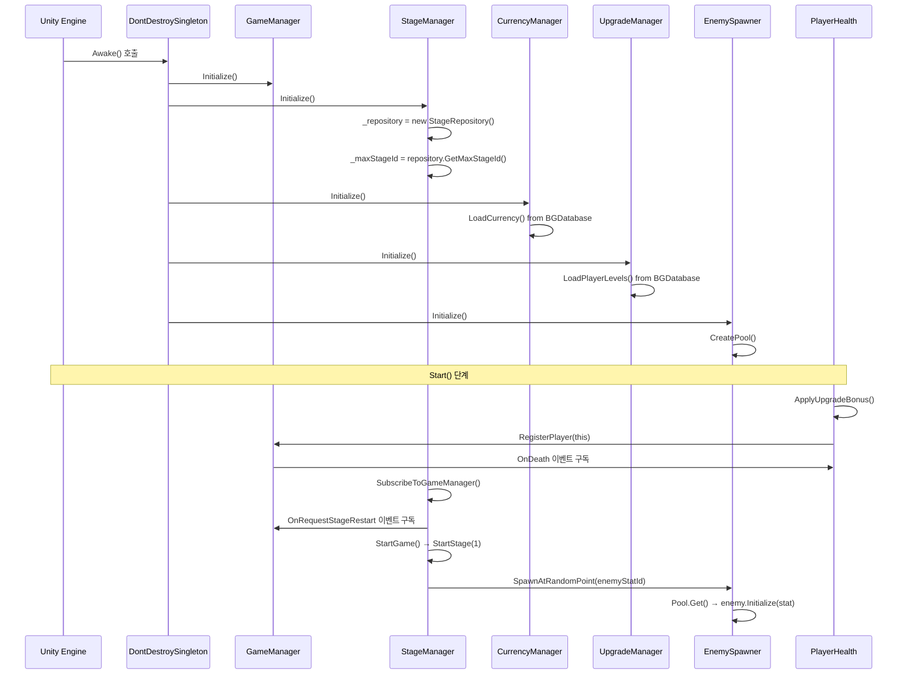
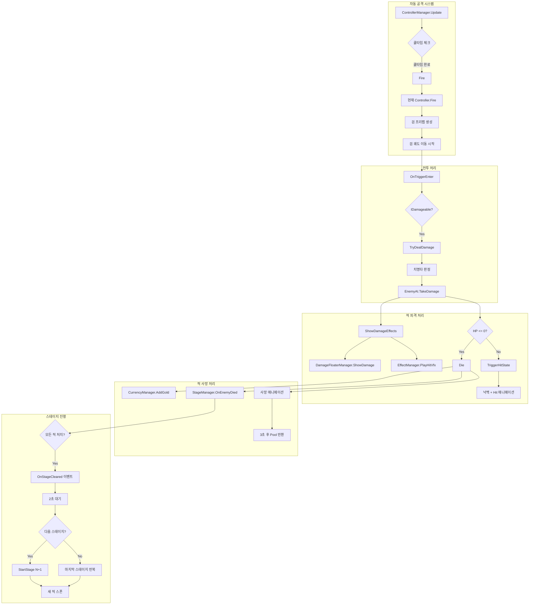
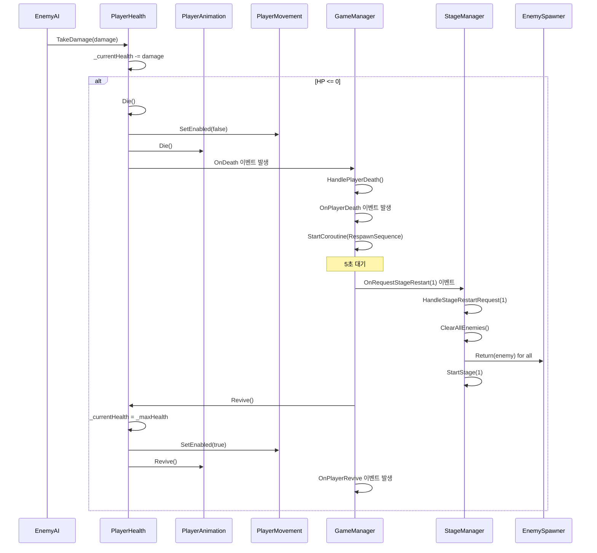
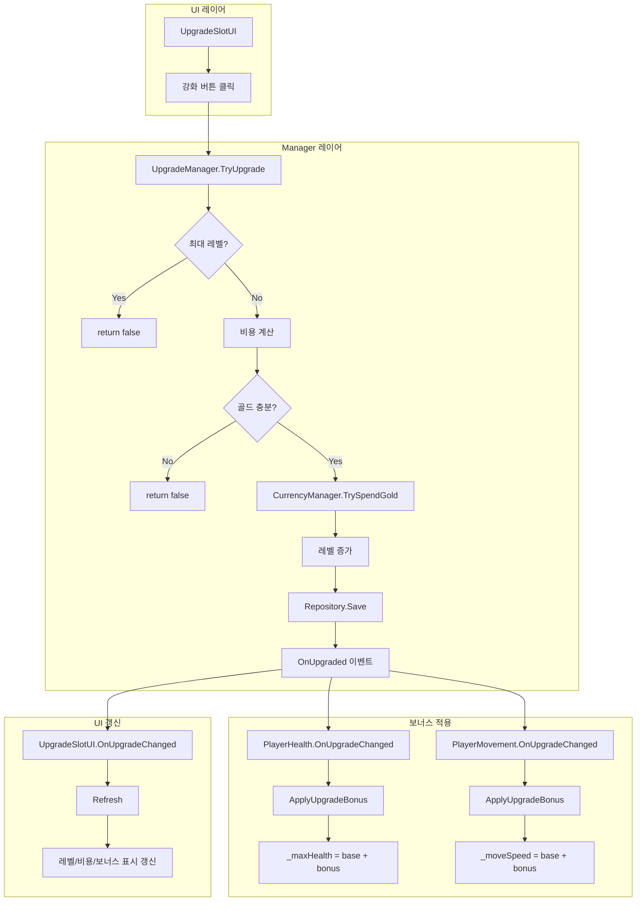
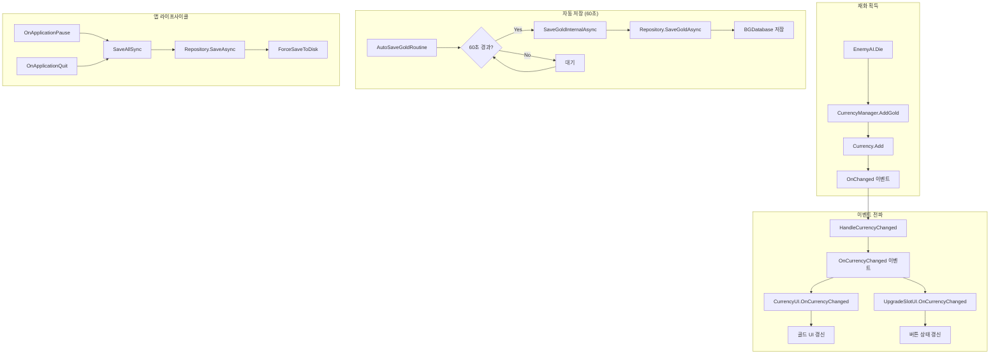

# SwordLordMaker - Technical Design Document (TDD)

> **버전**: 1.0
> **최종 업데이트**: 2026-01-14
> **엔진**: Unity 6
> **장르**: 방치형 모바일 RPG

---

## 목차

1. [프로젝트 아키텍처 개요](#1-프로젝트-아키텍처-개요)
2. [폴더 및 파일 구조도](#2-폴더-및-파일-구조도)
3. [핵심 스크립트 및 역할](#3-핵심-스크립트-및-역할)
4. [핵심 로직 흐름도](#4-핵심-로직-흐름도-mermaid-diagram)
5. [데이터 관리 및 저장](#5-데이터-관리-및-저장)
6. [Unity 에디터 설정 가이드](#6-unity-에디터-설정-가이드)

---

## 1. 프로젝트 아키텍처 개요

### 1.1 사용된 디자인 패턴

| 패턴 | 적용 위치 | 설명 |
|------|----------|------|
| **Singleton** | 모든 Manager 클래스 | `DontDestroySingleton<T>` 기반으로 씬 전환에도 유지 |
| **Observer (Event)** | Manager ↔ UI, Manager ↔ Manager | `event Action` 기반 느슨한 결합 |
| **Strategy** | Flying Sword 시스템 | `BaseFlyingSword`, `BaseSwordController` 추상화로 검 타입별 행동 교체 |
| **Repository** | 데이터 계층 | `IRepository` 인터페이스로 데이터 접근 추상화 |
| **Object Pool** | EnemySpawner | Unity `ObjectPool<T>` 활용으로 GC 최소화 |
| **DDD 4-Layer** | 전체 아키텍처 | Data → Repository → Manager → UI 계층 분리 |

### 1.2 DDD 4계층 아키텍처

```
┌─────────────────────────────────────────────────────────────────────┐
│                         UI Layer (Presentation)                      │
│  UpgradeUI, CurrencyUI, StageUI, PlayerHealthUI, EnemyHPBar         │
│  - 사용자 입력 처리, 시각적 표현                                      │
│  - Manager의 이벤트 구독하여 갱신                                     │
└─────────────────────────────────────────────────────────────────────┘
                                    │ 호출
                                    ▼
┌─────────────────────────────────────────────────────────────────────┐
│                       Manager Layer (Application)                    │
│  GameManager, StageManager, CurrencyManager, UpgradeManager,        │
│  EnemySpawner, ControllerManager, DamageFloaterManager              │
│  - 비즈니스 로직 오케스트레이션                                       │
│  - Repository와 Data 조합하여 유스케이스 실행                         │
└─────────────────────────────────────────────────────────────────────┘
                                    │ 호출
                                    ▼
┌─────────────────────────────────────────────────────────────────────┐
│                     Repository Layer (Infrastructure)                │
│  CurrencyRepository, UpgradeRepository, StageRepository,            │
│  EnemyStatRepository, SwordStatRepository                           │
│  - BGDatabase 연동                                                   │
│  - 데이터 영속화 (저장/로드)                                          │
└─────────────────────────────────────────────────────────────────────┘
                                    │ 참조
                                    ▼
┌─────────────────────────────────────────────────────────────────────┐
│                         Data Layer (Domain)                          │
│  Currency, SwordStat, EnemyStat, StageStat, UpgradeData,            │
│  PlayerUpgradeLevels, CurrencyType, UpgradeId                       │
│  - 순수 데이터 클래스 (POCO)                                          │
│  - record 타입으로 불변성 보장                                        │
└─────────────────────────────────────────────────────────────────────┘
```

### 1.3 전반적인 데이터 흐름 (Data Flow)

```
[BGDatabase Tables]
        │
        ▼ Load
[Repository] ──────▶ [Data Objects (record/class)]
        │                       │
        │                       ▼
        │              [Manager Layer]
        │                       │
        │         ┌─────────────┼─────────────┐
        │         ▼             ▼             ▼
        │    [GameManager] [StageManager] [CurrencyManager]
        │         │             │             │
        │         └─────────────┼─────────────┘
        │                       │ Events
        │                       ▼
        │              [UI Components]
        │                       │
        │                       ▼
        │              [User Interaction]
        │                       │
        ▼ Save                  ▼
[BGDatabase] ◀──────── [Repository.Save()]
```

### 1.4 Manager 간 이벤트 기반 통신

```
[PlayerHealth]
    │
    │ OnDeath 이벤트
    ▼
[GameManager]
    │
    │ OnRequestStageRestart 이벤트
    ▼
[StageManager]
    │
    │ OnStageStarted / OnStageCleared 이벤트
    ▼
[StageUI]

[EnemyAI.Die()]
    │
    │ CurrencyManager.AddGold()
    │ StageManager.OnEnemyDied()
    ▼
[CurrencyManager]
    │
    │ OnCurrencyChanged 이벤트
    ▼
[CurrencyUI] [UpgradeSlotUI]
```

---

## 2. 폴더 및 파일 구조도

### 2.1 전체 프로젝트 구조

```
Assets/
├── 01.Scenes/
│   ├── MainScene.unity          # 메인 게임 씬
│   └── StartScene.unity         # 시작 씬 (로딩)
│
├── 02.Scripts/                  # 핵심 게임 스크립트
│   ├── Currency/                # 재화 시스템
│   ├── Effect/                  # 이펙트 시스템
│   ├── Enemy/                   # 적 시스템
│   ├── Game/                    # 게임 매니저
│   ├── Player/                  # 플레이어 시스템
│   ├── Stage/                   # 스테이지 시스템
│   ├── Sword/                   # 검 스탯 데이터
│   ├── UI/                      # 공통 UI
│   ├── Upgrade/                 # 강화 시스템
│   └── Util/                    # 유틸리티 (Singleton 등)
│
├── 03.Prefabs/                  # 게임 프리팹
│   ├── Enemy_Skeleton.prefab
│   ├── Player.prefab
│   └── ...
│
├── DamageFloater/               # 데미지 플로터 모듈
│   └── 01.Scripts/
│       ├── Adel/                # 8자 궤도 검
│       ├── DamageFloater/       # 데미지 표시
│       ├── Hypocycloid/         # 하이포사이클로이드 검
│       ├── Manager/             # ControllerManager
│       ├── PixelHunterLike/     # 무한 루프 검
│       └── Base Classes         # 추상 기반 클래스
│
└── Settings/                    # URP 렌더링 설정
```

### 2.2 Scripts 상세 구조

```
Assets/02.Scripts/
│
├── Currency/                    # ═══ 재화 시스템 ═══
│   ├── Data/
│   │   ├── Currency.cs          # 재화 데이터 클래스 (Gold, Ruby)
│   │   └── CurrencyType.cs      # 재화 타입 enum
│   ├── Manager/
│   │   └── CurrencyManager.cs   # 재화 관리 싱글톤
│   ├── Repository/
│   │   └── CurrencyRepository.cs # BGDatabase 연동
│   ├── UI/
│   │   └── CurrencyUI.cs        # 재화 표시 UI
│   └── Util/
│       └── CurrencyFormatter.cs # 숫자 포맷팅 (1000 → 1K)
│
├── Effect/                      # ═══ 이펙트 시스템 ═══
│   └── Manager/
│       └── EffectManager.cs     # VFX 재생 관리
│
├── Enemy/                       # ═══ 적 시스템 ═══
│   ├── Data/
│   │   ├── EnemyStat.cs         # 적 스탯 record
│   │   └── IEnemyStatRepository.cs
│   ├── Manager/
│   │   └── EnemySpawner.cs      # 오브젝트 풀 + 스폰
│   ├── Repository/
│   │   └── EnemyStatRepository.cs
│   ├── UI/
│   │   ├── Billboard.cs         # HP바 빌보드
│   │   └── EnemyHPBar.cs        # HP바 UI
│   ├── EnemyAI.cs               # FSM 기반 AI
│   └── EnemyAnimation.cs        # 애니메이션 제어
│
├── Game/                        # ═══ 게임 매니저 ═══
│   └── GameManager.cs           # 사망/부활 시퀀스 관리
│
├── Player/                      # ═══ 플레이어 시스템 ═══
│   ├── PlayerAnimation.cs       # 애니메이션 제어
│   ├── PlayerHealth.cs          # 체력 + IDamageable
│   ├── PlayerHealthUI.cs        # HP바 UI
│   ├── PlayerMovement.cs        # 이동 (CharacterController)
│   └── QuarterViewCamera.cs     # 쿼터뷰 카메라
│
├── Stage/                       # ═══ 스테이지 시스템 ═══
│   ├── Data/
│   │   ├── IStageRepository.cs
│   │   └── StageStat.cs         # 스테이지 데이터 record
│   ├── Manager/
│   │   └── StageManager.cs      # 스테이지 진행 관리
│   └── Repository/
│       └── StageRepository.cs
│
├── Sword/                       # ═══ 검 스탯 시스템 ═══
│   ├── Data/
│   │   ├── ISwordStatRepository.cs
│   │   └── SwordStat.cs         # 검 스탯 record
│   └── Repository/
│       └── SwordStatRepository.cs
│
├── UI/                          # ═══ 공통 UI ═══
│   ├── MainSceneLoader.cs       # 씬 로드
│   └── StageUI.cs               # 스테이지 정보 표시
│
├── Upgrade/                     # ═══ 강화 시스템 ═══
│   ├── Data/
│   │   ├── IUpgradeRepository.cs
│   │   ├── PlayerUpgradeLevels.cs # 강화 레벨 저장
│   │   ├── UpgradeData.cs       # 강화 정보 record
│   │   └── UpgradeId.cs         # 강화 ID 상수
│   ├── Manager/
│   │   └── UpgradeManager.cs    # 강화 로직 관리
│   ├── Repository/
│   │   └── UpgradeRepository.cs
│   └── UI/
│       ├── UpgradeSlotUI.cs     # 개별 강화 슬롯
│       └── UpgradeUI.cs         # 강화 패널
│
├── Util/                        # ═══ 유틸리티 ═══
│   ├── DontDestroySingleton.cs  # 씬 유지 싱글톤
│   └── Singleton.cs             # 일반 싱글톤
│
└── FirstScript.cs               # (테스트용)
```

### 2.3 DamageFloater 모듈 구조

```
Assets/DamageFloater/01.Scripts/
│
├── Adel/                        # ═══ 8자 궤도 검 ═══
│   ├── AdelFlyingSword.cs       # 8자 궤도 이동 로직
│   └── AdelFlyingSwordController.cs
│
├── DamageFloater/               # ═══ 데미지 표시 ═══
│   ├── DamageFloater.cs         # DOTween 애니메이션
│   ├── DamageFloaterManager.cs  # 싱글톤 관리자
│   ├── DamageStyle.cs           # 스타일 enum (7가지)
│   ├── FloaterOption.cs         # 옵션 설정
│   ├── NumberFormat.cs          # 숫자 포맷
│   ├── PixelTextHelper.cs       # 픽셀 폰트 렌더링
│   └── Test/
│       └── DamageFloaterTester.cs
│
├── Hypocycloid/                 # ═══ 하이포사이클로이드 검 ═══
│   ├── HypoFlyingSword.cs       # 하이포 궤도 이동
│   └── HypoSwordController.cs
│
├── Manager/                     # ═══ 컨트롤러 관리 ═══
│   └── ControllerManager.cs     # 검 타입 전환, 자동 발사
│
├── PixelHunterLike/             # ═══ 무한 루프 검 ═══
│   ├── PixelFlyingSword.cs      # 무한 루프 이동
│   └── PixelSwordController.cs
│
├── Enemy/
│   └── DummyEnemy.cs            # 테스트용 더미 + IDamageable 인터페이스
│
├── Monster/
│   └── OrangeMushroomAnimation.cs
│
├── UI/
│   └── ModeChange.cs            # 검 모드 변경 UI
│
├── BaseFlyingSword.cs           # ★ 검 추상 기반 클래스
├── BaseSwordController.cs       # ★ 컨트롤러 추상 기반
└── SwordType.cs                 # 검 타입 enum
```

---

## 3. 핵심 스크립트 및 역할

### 3.1 Manager 클래스 (싱글톤)

| 클래스 | 역할 | 주요 함수 |
|--------|------|----------|
| **GameManager** | 게임 전체 흐름 관리, 플레이어 사망/부활 처리 | `RegisterPlayer()`, `HandlePlayerDeath()` |
| **StageManager** | 스테이지 진행, 적 스폰 관리, 스테이지 전환 | `StartStage()`, `OnEnemyDied()`, `RestartFromStage()` |
| **CurrencyManager** | 재화(Gold/Ruby) 관리, 자동 저장 | `AddGold()`, `TrySpendGold()`, `LoadCurrency()` |
| **UpgradeManager** | 강화 시스템, 스탯 보너스 계산 | `TryUpgrade()`, `GetBonus()`, `ApplyUpgrades()` |
| **EnemySpawner** | 적 오브젝트 풀, 스폰/반환 | `Spawn()`, `Return()`, `SpawnAtRandomPoint()` |
| **ControllerManager** | 검 타입 전환, 자동 발사 | `Fire()`, `SetMode()`, `SwitchMode()` |
| **DamageFloaterManager** | 데미지 텍스트 인스턴싱 | `ShowDamage()` |
| **EffectManager** | VFX 재생 | `PlayHitVfx()` |

### 3.2 Data 클래스 (record/class)

> **설계 원칙**: 방치형 게임의 특성상 전투 관련 수치(HP, 데미지 등)는 int(21억 한계)를 쉽게 초과합니다.
> 따라서 **모든 전투 수치는 `BigInteger`** 타입을 사용하여 무한 스케일링을 지원합니다.

| 클래스 | 타입 | 주요 필드 (BigInteger) | 설명 |
|--------|------|----------------------|------|
| **SwordStat** | `record` | AttackDamage, CritDamage | 검 스탯 (공격력, 치명타 데미지) |
| **EnemyStat** | `record` | MaxHP, AttackDamage, GoldReward | 적 스탯 (체력, 공격력, 골드) |
| **StageStat** | `record` | - | 스테이지 정보 (SpawnCount는 int 유지) |
| **UpgradeData** | `record` | BaseCost, BonusPerLevel | 강화 정보 (비용, 보너스) |
| **Currency** | `class` | Gold, Ruby | 재화 데이터 + 이벤트 |
| **PlayerUpgradeLevels** | `class` | - | 강화 레벨 저장 (레벨은 int) |

#### BigInteger 사용 필드 요약
| 분류 | 필드 | 이유 |
|------|------|------|
| **체력** | MaxHP, CurrentHealth | 무한 스케일링 |
| **데미지** | AttackDamage, CritDamage | 무한 스케일링 |
| **재화** | Gold, Ruby, GoldReward, BaseCost | 대량 재화 처리 |
| **보너스** | BonusPerLevel | 강화 보너스 누적 |

### 3.3 Player 클래스

| 클래스 | 역할 | 주요 함수 |
|--------|------|----------|
| **PlayerHealth** | 체력 관리, IDamageable 구현 | `TakeDamage()`, `Die()`, `Revive()`, `Heal()` |
| **PlayerMovement** | WASD 이동, CharacterController | `HandleInput()`, `Move()`, `Rotate()` |
| **PlayerAnimation** | 애니메이터 제어 | `SetMoving()`, `Die()`, `Revive()` |
| **QuarterViewCamera** | 카메라 추적 | `FollowTarget()` |

### 3.4 Enemy 클래스

| 클래스 | 역할 | 주요 함수 |
|--------|------|----------|
| **EnemyAI** | FSM 기반 AI (Idle/Chase/Attack/Hit/Dead) | `TakeDamage()`, `TriggerHitState()`, `Die()` |
| **EnemyAnimation** | 명령 기반 애니메이션 | `SetMoving()`, `SetAttacking()`, `TriggerHit()` |
| **EnemyHPBar** | HP바 UI | `Initialize()`, `UpdateHP()` |

### 3.5 Flying Sword 클래스 (전략 패턴)

| 클래스 | 궤도 타입 | 설명 |
|--------|----------|------|
| **BaseFlyingSword** | 추상 | 공통 로직 (높이 제한, 데미지 처리) |
| **BaseSwordController** | 추상 | 공통 API (`Fire()`, `StopSequence()`) |
| **AdelFlyingSword** | 8자 궤도 | Lissajous 곡선 기반 이동 |
| **HypoFlyingSword** | 하이포사이클로이드 | 수학적 궤도 이동 |
| **PixelFlyingSword** | 무한 루프 | 적 추적 + 귀환 |

### 3.6 Manager 의존 관계도

```
                    ┌─────────────────┐
                    │   GameManager   │
                    │  (사망/부활)    │
                    └────────┬────────┘
                             │ OnRequestStageRestart
                             ▼
┌─────────────────┐  ┌─────────────────┐  ┌─────────────────┐
│ControllerManager│  │  StageManager   │  │ CurrencyManager │
│  (검 발사)      │  │  (스테이지)     │  │   (재화)        │
└────────┬────────┘  └────────┬────────┘  └────────┬────────┘
         │                    │                    │
         │                    ▼                    │
         │           ┌─────────────────┐           │
         │           │  EnemySpawner   │           │
         │           │  (적 스폰)      │           │
         │           └────────┬────────┘           │
         │                    │                    │
         ▼                    ▼                    ▼
┌─────────────────────────────────────────────────────────────┐
│                     게임 오브젝트들                          │
│  Player (PlayerHealth, PlayerMovement, PlayerAnimation)     │
│  Enemy (EnemyAI, EnemyAnimation)                           │
│  FlyingSword (Adel, Hypo, Pixel)                           │
└─────────────────────────────────────────────────────────────┘
         │                    │
         ▼                    ▼
┌─────────────────┐  ┌─────────────────┐
│UpgradeManager   │  │DamageFloaterMgr │
│  (강화 보너스)  │  │  (데미지 표시)  │
└─────────────────┘  └─────────────────┘
```

---

## 4. 핵심 로직 흐름도 (Mermaid Diagram)

### 4.1 게임 시작 초기화 흐름



### 4.2 전투 진행 및 적 처치 루프



### 4.3 플레이어 사망 및 부활 시퀀스



### 4.4 강화 시스템 흐름



### 4.5 재화 획득 및 저장 루프



---

## 5. 데이터 관리 및 저장

### 5.1 데이터 저장 시스템 개요

| 데이터 | 저장 위치 | 저장 시점 | 로드 시점 |
|--------|----------|----------|----------|
| Gold | BGDatabase (PlayerProfile) | 60초 자동, 앱 종료 시 | Manager Initialize |
| Ruby | BGDatabase (PlayerProfile) | 즉시 (변경 시) | Manager Initialize |
| 강화 레벨 | BGDatabase (PlayerProfile.UpgradeLevels) | 강화 성공 시 | Manager Initialize |
| 적 스탯 | BGDatabase (EnemyStat) | 에디터에서 설정 | Spawner Initialize |
| 스테이지 정보 | BGDatabase (StageStat) | 에디터에서 설정 | StageManager Initialize |
| 검 스탯 | BGDatabase (SwordStat) | 에디터에서 설정 | Controller Initialize |
| 강화 정보 | BGDatabase (UpgradeData) | 에디터에서 설정 | UpgradeManager Initialize |

### 5.2 BGDatabase 테이블 구조

> **중요**: BGDatabase는 BigInteger를 직접 지원하지 않으므로, BigInteger 값은 **string 타입으로 저장**합니다.
> Repository에서 로드 시 `BigInteger.Parse()`로 변환합니다.

#### PlayerProfile 테이블 (저장 데이터)
| 필드 | DB 타입 | C# 타입 | 설명 |
|------|--------|--------|------|
| name | string | string | 프로필 ID (기본키) |
| Gold | string | BigInteger | 골드 (JSON 문자열) |
| Ruby | string | BigInteger | 루비 (JSON 문자열) |
| UpgradeLevels | string | Dictionary | 강화 레벨 (JSON) |

#### EnemyStat 테이블 (읽기 전용)
| 필드 | DB 타입 | C# 타입 | 설명 |
|------|--------|--------|------|
| name | string | string | 적 ID (예: "Skeleton_01") |
| MaxHP | string | **BigInteger** | 최대 체력 |
| AttackDamage | string | **BigInteger** | 공격력 |
| MoveSpeed | float | float | 이동 속도 |
| GoldReward | string | **BigInteger** | 처치 시 골드 |

#### SwordStat 테이블 (읽기 전용)
| 필드 | DB 타입 | C# 타입 | 설명 |
|------|--------|--------|------|
| name | string | string | 검 ID (예: "Adel_01") |
| AttackDamage | string | **BigInteger** | 기본 공격력 |
| Cooldown | float | float | 공격 쿨타임 배율 |
| MoveSpeed | float | float | 검 이동 속도 |
| CritDamage | string | **BigInteger** | 치명타 추가 데미지 |
| CritChance | float | float | 치명타 확률 (0~1) |

#### StageStat 테이블 (읽기 전용)
| 필드 | DB 타입 | C# 타입 | 설명 |
|------|--------|--------|------|
| StageId | int | int | 스테이지 번호 (1~10) |
| StageName | string | string | 표시 이름 ("1-1" 등) |
| SpawnCount | int | int | 스폰할 적 수 |
| EnemyStatId | string | string | 스폰할 적 타입 |

#### UpgradeData 테이블 (읽기 전용)
| 필드 | DB 타입 | C# 타입 | 설명 |
|------|--------|--------|------|
| name | string | string | 강화 ID (예: "Player_Health") |
| DisplayName | string | string | 표시 이름 |
| BaseCost | string | **BigInteger** | 기본 비용 |
| CostMultiplier | float | float | 레벨당 비용 배율 |
| BonusPerLevel | string | **BigInteger** | 레벨당 보너스 |
| MaxLevel | int | int | 최대 레벨 |

### 5.3 데이터 클래스 정의

> **BigInteger 사용 원칙**: 전투/재화 수치 → BigInteger, 확률/배율/속도 → float, 레벨/개수 → int

#### IDamageable.cs (인터페이스)
```csharp
using System.Numerics;

public interface IDamageable
{
    void TakeDamage(BigInteger damage, bool isCrit);
}
```

#### SwordStat.cs (record - 불변)
```csharp
using System.Numerics;

public record SwordStat(
    string Id,
    BigInteger AttackDamage,    // 기본 공격력 (BigInteger)
    float Cooldown,             // 쿨타임 배율 (float)
    float MoveSpeed,            // 이동 속도 (float)
    BigInteger CritDamage,      // 치명타 추가 데미지 (BigInteger)
    float CritChance            // 치명타 확률 0~1 (float)
)
{
    // 치명타 시 최종 데미지 계산
    public BigInteger CalculateDamage(bool isCrit)
    {
        return isCrit ? AttackDamage + CritDamage : AttackDamage;
    }
}
```

#### EnemyStat.cs (record - 불변)
```csharp
using System.Numerics;

public record EnemyStat(
    string Id,
    BigInteger MaxHP,           // 최대 체력 (BigInteger)
    BigInteger AttackDamage,    // 공격력 (BigInteger)
    float MoveSpeed,            // 이동 속도 (float)
    BigInteger GoldReward       // 처치 보상 (BigInteger)
);
```

#### UpgradeData.cs (record - 불변)
```csharp
using System.Numerics;

public record UpgradeData(
    string Id,
    string DisplayName,
    BigInteger BaseCost,        // 기본 비용 (BigInteger)
    float CostMultiplier,       // 비용 배율 (float)
    BigInteger BonusPerLevel,   // 레벨당 보너스 (BigInteger)
    int MaxLevel                // 최대 레벨 (int)
)
{
    public BigInteger GetCost(int currentLevel)
    {
        // BaseCost * (CostMultiplier ^ level)
        double multiplier = Math.Pow(CostMultiplier, currentLevel);
        return new BigInteger(multiplier) * BaseCost;
    }

    public BigInteger GetTotalBonus(int level)
    {
        return BonusPerLevel * level;
    }

    public bool IsMaxLevel(int level) => level >= MaxLevel;
}
```

#### Currency.cs (class - 가변, 이벤트 포함)
```csharp
using System.Numerics;

public class Currency
{
    private BigInteger _gold;
    private BigInteger _ruby;

    public BigInteger Gold => _gold;
    public BigInteger Ruby => _ruby;

    public event Action<CurrencyType, BigInteger> OnChanged;

    public void Add(CurrencyType type, BigInteger amount) { ... }
    public bool TrySpend(CurrencyType type, BigInteger amount) { ... }
}
```

#### PlayerUpgradeLevels.cs (class - JSON 직렬화)
```csharp
public class PlayerUpgradeLevels
{
    private Dictionary<string, int> _levels = new();

    public int GetLevel(string upgradeId);      // 레벨은 int 유지
    public void IncrementLevel(string upgradeId);
    public string ToJson();
    public static PlayerUpgradeLevels FromJson(string json);
}
```

### 5.4 Repository 패턴 구현

```csharp
// 인터페이스 (Data 레이어)
public interface ICurrencyRepository
{
    Task<Currency> LoadAsync();
    Task SaveAsync(Currency currency);
    Task SaveGoldAsync(BigInteger gold);
    Task SaveRubyAsync(BigInteger ruby);
    void ForceSaveToDisk();
}

// 구현체 (Repository 레이어)
public class CurrencyRepository : ICurrencyRepository
{
    public async Task<Currency> LoadAsync()
    {
        // BGDatabase에서 PlayerProfile 로드
        var entity = BGDatabase.GetEntity<PlayerProfile>("default");
        return new Currency(
            ParseBigInteger(entity.Gold),
            ParseBigInteger(entity.Ruby)
        );
    }

    public async Task SaveAsync(Currency currency)
    {
        var entity = BGDatabase.GetEntity<PlayerProfile>("default");
        entity.Gold = currency.Gold.ToString();
        entity.Ruby = currency.Ruby.ToString();
        BGDatabase.Save();
    }
}
```

---

## 6. Unity 에디터 설정 가이드

### 6.1 씬 계층 구조 (Hierarchy)

```
MainScene
│
├── ═══ Managers ═══
│   ├── GameManager          [GameManager.cs]
│   ├── StageManager         [StageManager.cs]
│   ├── CurrencyManager      [CurrencyManager.cs]
│   ├── UpgradeManager       [UpgradeManager.cs]
│   ├── EnemySpawner         [EnemySpawner.cs]
│   ├── ControllerManager    [ControllerManager.cs]
│   ├── DamageFloaterManager [DamageFloaterManager.cs]
│   └── EffectManager        [EffectManager.cs]
│
├── ═══ Player ═══
│   └── Player               [PlayerHealth, PlayerMovement, PlayerAnimation]
│       ├── Model            (캐릭터 메시)
│       ├── Animator         (애니메이터)
│       └── HealthBar        [PlayerHealthUI.cs]
│
├── ═══ Cameras ═══
│   └── Main Camera          [QuarterViewCamera.cs]
│
├── ═══ Environment ═══
│   ├── Ground               (NavMesh Surface)
│   ├── Walls
│   └── SpawnPoints
│       ├── SpawnPoint_01
│       ├── SpawnPoint_02
│       └── ...
│
├── ═══ Sword Controllers ═══
│   ├── AdelController       [AdelFlyingSwordController.cs]
│   ├── HypoController       [HypoSwordController.cs]
│   └── PixelController      [PixelSwordController.cs]
│
├── ═══ UI ═══
│   ├── Canvas
│   │   ├── CurrencyPanel    [CurrencyUI.cs]
│   │   ├── StagePanel       [StageUI.cs]
│   │   ├── UpgradePanel     [UpgradeUI.cs]
│   │   │   ├── HealthSlot   [UpgradeSlotUI.cs]
│   │   │   ├── SpeedSlot    [UpgradeSlotUI.cs]
│   │   │   └── ...
│   │   └── PlayerHealthBar  [PlayerHealthUI.cs]
│   └── WorldSpaceCanvas     (적 HP바용)
│
└── ═══ Effects ═══
    └── EffectPool           (VFX 풀)
```

### 6.2 필수 Prefab 목록

| Prefab | 경로 | 컴포넌트 |
|--------|------|----------|
| **Player** | `03.Prefabs/Player.prefab` | PlayerHealth, PlayerMovement, PlayerAnimation, CharacterController |
| **Enemy_Skeleton** | `03.Prefabs/Enemy_Skeleton.prefab` | EnemyAI, EnemyAnimation, NavMeshAgent, EnemyHPBar |
| **DamageFloater** | `DamageFloater/02.Prefabs/DamageFloater.prefab` | DamageFloater, TextMeshPro |
| **AdelSword** | `DamageFloater/02.Prefabs/AdelSword.prefab` | AdelFlyingSword, Collider |
| **HypoSword** | `DamageFloater/02.Prefabs/HypoSword.prefab` | HypoFlyingSword, Collider |
| **PixelSword** | `DamageFloater/02.Prefabs/PixelSword.prefab` | PixelFlyingSword, Collider |
| **HitVFX** | `03.Prefabs/Effects/HitVFX.prefab` | ParticleSystem |

### 6.3 Manager Inspector 설정

#### EnemySpawner
```
Enemy Prefab: Enemy_Skeleton (Prefab)
Spawn Points: [SpawnPoint_01, SpawnPoint_02, ...]
Default Capacity: 10
Max Size: 50
```

#### StageManager
```
Auto Start On Awake: ✓
Spawn Interval: 0.5
Stage Transition Delay: 2.0
```

#### ControllerManager
```
Adel Controller: (AdelController 오브젝트)
Hypo Controller: (HypoController 오브젝트)
Pixel Controller: (PixelController 오브젝트)
Mode Text: (TMP_Text)
Base Cooldown: 20.0
```

#### DamageFloaterManager
```
Damage Floater Prefab: DamageFloater (Prefab)
Single Floater Option: (FloaterOption)
Multi Floater Option: (FloaterOption)
```

### 6.4 태그 및 레이어 설정

#### Tags (필수)
- `Player` - 플레이어 오브젝트
- `Enemy` - 적 오브젝트

#### Layers (권장)
- `Player` - 플레이어 충돌
- `Enemy` - 적 충돌
- `Sword` - 검 충돌
- `Ground` - 바닥

### 6.5 NavMesh 설정

1. **Navigation Window 열기**: Window → AI → Navigation
2. **Ground 오브젝트 선택** → Navigation Static 체크
3. **Bake 탭**에서 Agent 설정:
   - Agent Radius: 0.5
   - Agent Height: 2.0
   - Max Slope: 45
4. **Bake 버튼** 클릭

### 6.6 BGDatabase 테이블 설정 순서

1. **BGDatabase 에디터 열기**: Window → BGDatabase → Database
2. **테이블 생성 순서**:
   - PlayerProfile (저장용)
   - EnemyStat (적 스탯)
   - StageStat (스테이지 정보)
   - SwordStat (검 스탯)
   - UpgradeData (강화 정보)
3. **필드 추가** (위 5.2 참고)
4. **데이터 입력**

### 6.7 프로젝트 빌드 체크리스트

- [ ] BGDatabase 테이블 데이터 입력 완료
- [ ] NavMesh Bake 완료
- [ ] 모든 Prefab 연결 확인
- [ ] SpawnPoints 배치 완료
- [ ] Manager 싱글톤 씬에 배치
- [ ] Player 태그 설정
- [ ] Enemy 태그 설정
- [ ] UI Canvas 해상도 설정

---

## 부록: 빠른 참조

### A. 주요 이벤트 목록

| 클래스 | 이벤트 | 파라미터 | 용도 |
|--------|--------|----------|------|
| GameManager | OnPlayerDeath | - | 플레이어 사망 알림 |
| GameManager | OnPlayerRevive | - | 플레이어 부활 알림 |
| GameManager | OnRequestStageRestart | int stageId | 스테이지 리셋 요청 |
| StageManager | OnStageStarted | int stageId | 스테이지 시작 |
| StageManager | OnStageCleared | int stageId | 스테이지 클리어 |
| CurrencyManager | OnCurrencyChanged | CurrencyType, BigInteger | 재화 변경 |
| UpgradeManager | OnUpgraded | string upgradeId, int level | 강화 완료 |
| PlayerHealth | OnHealthChanged | int current, int max | 체력 변경 |
| PlayerHealth | OnDeath | - | 사망 |

### B. UpgradeId 상수

```csharp
public static class UpgradeId
{
    public const string PlayerHealth = "Player_Health";
    public const string PlayerMoveSpeed = "Player_MoveSpeed";
    public const string SwordAttackDamage = "Sword_AttackDamage";
    public const string SwordCooldown = "Sword_Cooldown";
    public const string SwordMoveSpeed = "Sword_MoveSpeed";
    public const string SwordCritDamage = "Sword_CritDamage";
    public const string SwordCritChance = "Sword_CritChance";
}
```

### C. 검 타입 열거형

```csharp
public enum SwordType
{
    Adel,   // 8자 궤도
    Hypo,   // 하이포사이클로이드
    Pixel   // 무한 루프
}
```

---

> **문서 끝**
> 이 문서는 SwordLordMaker 프로젝트의 전체 아키텍처를 설명합니다.
> 신규 개발자는 이 문서를 참고하여 프로젝트 구조를 이해하고 개발을 시작할 수 있습니다.
