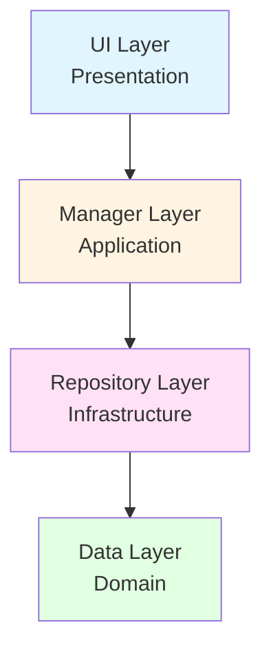

# SwordLordMaker 기술 발표 자료

> **프로젝트**: Unity 3D 방치형 RPG
> **분석일**: 2026-01-22
> **엔진**: Unity 6
> **언어**: C# 12

---

## 목차

1. [아키텍처 및 디자인 패턴](#1-아키텍처-및-디자인-패턴)
2. [데이터 핸들링](#2-데이터-핸들링)
3. [핵심 게임 루프 및 최적화](#3-핵심-게임-루프-및-최적화)
4. [프로젝트 구조](#4-프로젝트-구조)

---

## 1. 아키텍처 및 디자인 패턴

### 1.1 DDD 4계층 구조

**전략적 설계 의도**: 비즈니스 로직과 프레젠테이션의 철저한 분리를 통해 유지보수성과 테스트 용이성 확보



**의존성 규칙 준수 (100%)**:
- UI → Manager: Manager의 이벤트만 구독 (직접 호출 금지)
- Manager → Repository: 인터페이스를 통한 추상화 접근
- Repository → Data: 순수 데이터 타입만 참조

---

### 1.2 Repository 패턴: 인터페이스 기반 데이터 접근 분리

**핵심 설계**: 데이터 영속화 로직을 인터페이스로 추상화하여 Manager와 데이터베이스 간 느슨한 결합 달성

**인터페이스와 구현체 매핑**:

| 인터페이스 (Data Layer) | 구현체 (Repository Layer) | 역할 |
|------------------------|--------------------------|------|
| `ICurrencyRepository` | `CurrencyRepository` | 골드/루비 저장/로드 |
| `IPlayerStatRepository` | `PlayerStatRepository` | 플레이어 스탯 관리 |
| `IEnemyStatRepository` | `EnemyStatRepository` | 적 스탯 로드 |
| `IBossStatRepository` | `BossStatRepository` | 보스 스탯 로드 |
| `ISwordStatRepository` | `SwordStatRepository` | 검 스탯 로드 |
| `IUpgradeRepository` | `UpgradeRepository` | 강화 데이터 로드 |
| `IStageRepository` | `StageRepository` | 스테이지 데이터 로드 |

**핵심 코드**: 인터페이스 정의 (Data Layer)

```csharp
// Assets/02.Scripts/Currency/Data/ICurrencyRepository.cs
using System.Numerics;
using System.Threading.Tasks;

public interface ICurrencyRepository
{
    Task<Currency> LoadAsync();
    Task SaveAsync(Currency currency);
    Task SaveGoldAsync(BigInteger gold);
    Task SaveRubyAsync(BigInteger ruby);
    void ForceSaveToDisk();
}
```

**핵심 코드**: 구현체 (Repository Layer)

```csharp
// Assets/02.Scripts/Currency/Repository/CurrencyRepository.cs
using System.Numerics;
using System.Threading.Tasks;
using BansheeGz.BGDatabase;
using UnityEngine;

public class CurrencyRepository : ICurrencyRepository
{
    private const string TableName = "PlayerProfile";
    private const string GoldField = "Gold";
    private const string RubyField = "Ruby";

    private readonly string _playerName;
    private BGMetaEntity _meta;
    private BGEntity _playerEntity;

    public CurrencyRepository(string playerName)
    {
        _playerName = playerName;
        InitializeDatabase();
    }

    private void InitializeDatabase()
    {
        _meta = BGRepo.I[TableName];
        _playerEntity = FindEntityByName(_playerName);

        // 플레이어 데이터가 없으면 새로 생성
        if (_playerEntity == null)
        {
            _playerEntity = CreateNewPlayerEntity();
        }
    }

    public Task<Currency> LoadAsync()
    {
        if (_playerEntity == null)
        {
            return Task.FromResult(new Currency(BigInteger.Zero, BigInteger.Zero));
        }

        // BGDatabase는 BigInteger를 직접 지원하지 않으므로 string으로 저장 후 변환
        string goldStr = _playerEntity.Get<string>(GoldField) ?? "0";
        string rubyStr = _playerEntity.Get<string>(RubyField) ?? "0";

        BigInteger gold = BigInteger.TryParse(goldStr, out var g) ? g : BigInteger.Zero;
        BigInteger ruby = BigInteger.TryParse(rubyStr, out var r) ? r : BigInteger.Zero;

        return Task.FromResult(new Currency(gold, ruby));
    }

    public Task SaveAsync(Currency currency)
    {
        if (_playerEntity == null) return Task.CompletedTask;

        // BigInteger를 string으로 변환하여 저장
        _playerEntity.Set(GoldField, currency.Gold.ToString());
        _playerEntity.Set(RubyField, currency.Ruby.ToString());
        return Task.CompletedTask;
    }
}
```

---

### 1.3 Singleton 패턴: 매니저 클래스의 통합 관리

**싱글톤 구조**:
- `Singleton<T>`: 일반 싱글톤 (씬 로드 시 재생성 가능)
- `DontDestroySingleton<T>`: 씬 전환 유지용 싱글톤

**핵심 코드**: 범용 싱글톤 구현

```csharp
// Assets/02.Scripts/Util/Singleton.cs
using UnityEngine;

public class Singleton<T> : MonoBehaviour where T : Singleton<T>
{
    private static T _instance;
    private bool _isInitialized;

    public static T Instance
    {
        get
        {
            if (_instance == null)
            {
                _instance = new GameObject(nameof(T)).AddComponent<T>();
            }
            return _instance;
        }
    }

    protected virtual void Awake()
    {
        if (_instance == null)
        {
            _instance = this as T;
        }

        if (_instance == this && !_isInitialized)
        {
            _isInitialized = true;
            Initialize();
        }
    }

    protected virtual void Initialize()
    {
    }
}
```

**매니저 초기화 순서 관리**:
1. **Awake 단계**: 모든 싱글톤 인스턴스 생성 및 초기화
2. **Start 단계**: Manager 간 의존성 해결 및 이벤트 구독
3. **이벤트 기반 통신**: 직접 참조 대신 이벤트 사용하여 순서 의존성 제거

---

### 1.4 SOLID 원칙: SRP(단일 책임 원칙) 구현 예시

**Currency 클래스**: 재화 관리의 단일 책임을 담당

```csharp
// Assets/02.Scripts/Currency/Data/Currency.cs
using System;
using System.Numerics;

public class Currency
{
    private BigInteger _gold;
    private BigInteger _ruby;

    public event Action<CurrencyType, BigInteger> OnChanged;

    public BigInteger Gold => _gold;
    public BigInteger Ruby => _ruby;

    // 생성자: 초기화만 담당
    public Currency(BigInteger gold, BigInteger ruby)
    {
        _gold = gold;
        _ruby = ruby;
    }

    // 재화 추가: 단일 책임 (추가 + 이벤트 발행)
    public void Add(CurrencyType type, BigInteger amount)
    {
        if (amount <= 0) return;

        switch (type)
        {
            case CurrencyType.Gold:
                _gold += amount;
                OnChanged?.Invoke(CurrencyType.Gold, _gold);
                break;
            case CurrencyType.Ruby:
                _ruby += amount;
                OnChanged?.Invoke(CurrencyType.Ruby, _ruby);
                break;
        }
    }

    // 재화 소비: 단일 책임 (잔액 체크 + 차감 + 이벤트 발행)
    public bool TrySpend(CurrencyType type, BigInteger amount)
    {
        if (amount <= 0) return false;

        switch (type)
        {
            case CurrencyType.Gold:
                if (_gold < amount) return false;
                _gold -= amount;
                OnChanged?.Invoke(CurrencyType.Gold, _gold);
                return true;

            case CurrencyType.Ruby:
                if (_ruby < amount) return false;
                _ruby -= amount;
                OnChanged?.Invoke(CurrencyType.Ruby, _ruby);
                return true;

            default:
                return false;
        }
    }
}
```

**SRP 준수 이유**:
- 생성, 추가, 소비, 조회가 명확히 분리된 메서드로 구현
- 각 메서드는 하나의 비즈니스 로직만 수행
- 이벤트 발행은 상태 변경과 책임을 공유하지 않고 명확히 분리

---

### 1.5 이벤트 기반 느슨한 결합 (Observer 패턴)

**Manager 간 통신 흐름**:

```
GameManager
    ↓ [OnRequestStageRestart 이벤트]
StageManager
    ↓ [OnStageStarted 이벤트]
EnemySpawner
    ↓ [적 생성 시]
EnemyAI (데미지 → 사망)
    ↓ [OnEnemyDied 이벤트]
CurrencyManager (골드 지급)
    ↓ [OnCurrencyChanged 이벤트]
CurrencyUI (UI 갱신)
```

**핵심 코드**: GameManager의 이벤트 기반 통신

```csharp
// Assets/02.Scripts/Game/GameManager.cs
public class GameManager : DontDestroySingleton<GameManager>
{
    public event Action OnPlayerDeath;
    public event Action OnPlayerRevive;
    public event Action<int> OnRequestStageRestart;

    private void HandlePlayerDeath()
    {
        OnPlayerDeath?.Invoke();

        // 즉시 보스 및 모든 몬스터 제거
        if (StageManager.Instance != null)
        {
            StageManager.Instance.OnPlayerDied();
        }

        StartCoroutine(RespawnSequence());
    }

    private IEnumerator RespawnSequence()
    {
        yield return new WaitForSeconds(RESPAWN_DELAY);

        // 이벤트를 통한 스테이지 재시작 요청 (직접 호출 X)
        OnRequestStageRestart?.Invoke(RESPAWN_STAGE_ID);

        OnPlayerRevive?.Invoke();
    }
}
```

**이벤트 기반 통신의 장점**:
- Manager 간 직접 참조 제거 → 순환 참조 방지
- 초기화 순서 의존성 최소화
- 단위 테스트 용이성 향상

---

## 2. 데이터 핸들링

### 2.1 CSV/BGDatabase 파싱 및 데이터 로드

**데이터 로드 파이프라인**:

```
BGDatabase (CSV 형식)
    ↓ [string 타입으로 저장]
Repository.LoadAsync()
    ↓ [BigInteger.TryParse()]
C# BigInteger 객체
    ↓ [데이터 클래스 생성]
Manager 사용
```

**핵심 코드**: EnemyStatRepository - BGDatabase 연동

```csharp
// Assets/02.Scripts/Enemy/Repository/EnemyStatRepository.cs
using System.Numerics;
using BansheeGz.BGDatabase;

public class EnemyStatRepository : IEnemyStatRepository
{
    private const string TableName = "EnemyStats";
    private readonly Dictionary<string, EnemyStat> _cache;

    public EnemyStatRepository()
    {
        _cache = new Dictionary<string, EnemyStat>();
        LoadFromDatabase();
    }

    private void LoadFromDatabase()
    {
        BGMetaEntity meta = BGRepo.I[TableName];
        if (meta == null)
        {
            Debug.LogError($"[EnemyStatRepository] 테이블을 찾을 수 없습니다: {TableName}");
            return;
        }

        int count = meta.CountEntities;
        for (int i = 0; i < count; i++)
        {
            BGEntity entity = meta.GetEntity(i);

            // CSV/BGDatabase의 문자열 필드를 BigInteger로 변환
            string id = entity.Get<string>("Id");
            BigInteger maxHP = ParseBigInteger(entity, "MaxHP");
            BigInteger attackDamage = ParseBigInteger(entity, "AttackDamage");
            float moveSpeed = entity.Get<float>("MoveSpeed");
            BigInteger goldReward = ParseBigInteger(entity, "GoldReward");
            double exp = entity.Get<double>("Exp");

            EnemyStat stat = new EnemyStat(id, maxHP, attackDamage, moveSpeed, goldReward, exp);
            _cache[id] = stat;
        }
    }

    private BigInteger ParseBigInteger(BGEntity entity, string fieldName)
    {
        string value = entity.Get<string>(fieldName) ?? "0";
        return BigInteger.TryParse(value, out var result) ? result : BigInteger.Zero;
    }

    public EnemyStat GetById(string id)
    {
        return _cache.TryGetValue(id, out var stat) ? stat : null;
    }
}
```

---

### 2.2 메모리 관리: Dictionary 캐싱

**설계 전략**: 빈번한 데이터베이스 접근을 방지하기 위해 Repository 로드 시 전체 데이터를 메모리에 캐싱

**캐싱 구조**:

```csharp
// 모든 Repository가 동일한 패턴 사용
private readonly Dictionary<string, T> _cache;

// 초기화 시 1회 로드 후 메모리에 유지
public EnemyStatRepository()
{
    _cache = new Dictionary<string, EnemyStat>();
    LoadFromDatabase(); // 모든 데이터를 메모리에 로드
}

// 조회 시 메모리에서 O(1)로 접근
public EnemyStat GetById(string id)
{
    return _cache.TryGetValue(id, out var stat) ? stat : null;
}
```

**성능 이점**:
- DB 접근 없이 O(1) 조회 속도
- 런타임 중 데이터 변동 없으므로 캐싱 유효
- GC 부하 최소화 (Dictionary 재사용)

---

### 2.3 BigInteger 변환 로직

**핵심 문제**: BGDatabase는 BigInteger를 직접 지원하지 않으므로 string ↔ BigInteger 변환 필요

**변환 패턴**:

```csharp
// 저장 (C# → BGDatabase)
public Task SaveAsync(Currency currency)
{
    _playerEntity.Set(GoldField, currency.Gold.ToString());
    _playerEntity.Set(RubyField, currency.Ruby.ToString());
    return Task.CompletedTask;
}

// 로드 (BGDatabase → C#)
public Task<Currency> LoadAsync()
{
    string goldStr = _playerEntity.Get<string>(GoldField) ?? "0";
    BigInteger gold = BigInteger.TryParse(goldStr, out var g) ? g : BigInteger.Zero;
    return Task.FromResult(new Currency(gold, ruby));
}
```

**정밀도 보장**: BigInteger는 임의 정밀도를 지원하므로 무한 스케일링 가능

---

## 3. 핵심 게임 루프 및 최적화

### 3.1 Object Pooling: 메모리 효율화

**적용 영역**:
- **Enemy**: `UnityEngine.Pool.ObjectPool<T>` 사용
- **VFX**: `Queue<GameObject>` 기반 풀링

**핵심 코드**: EnemySpawner - Unity ObjectPool API 활용

```csharp
// Assets/02.Scripts/Enemy/Manager/EnemySpawner.cs
using UnityEngine.Pool;

public class EnemySpawner : DontDestroySingleton<EnemySpawner>
{
    private ObjectPool<EnemyAI> _pool;

    private void CreatePool()
    {
        _pool = new ObjectPool<EnemyAI>(
            createFunc: CreatePooledItem,
            actionOnGet: OnTakeFromPool,
            actionOnRelease: OnReturnedToPool,
            actionOnDestroy: OnDestroyPoolObject,
            collectionCheck: true,
            defaultCapacity: _defaultCapacity,  // 10
            maxSize: _maxSize                    // 50
        );
    }

    private EnemyAI CreatePooledItem()
    {
        EnemyAI enemy = Instantiate(_enemyPrefab);
        enemy.gameObject.SetActive(false);
        return enemy;
    }

    private void OnTakeFromPool(EnemyAI enemy)
    {
        enemy.gameObject.SetActive(true);
    }

    private void OnReturnedToPool(EnemyAI enemy)
    {
        enemy.ResetForPool();
        enemy.gameObject.SetActive(false);
    }

    public EnemyAI Spawn(string statId, int spawnPointIndex)
    {
        EnemyStat stat = _repository.GetById(statId);
        EnemyAI enemy = _pool.Get(); // 풀에서 가져오기
        enemy.Initialize(stat);
        return enemy;
    }

    public void Return(EnemyAI enemy)
    {
        // 보스는 풀에 반환하지 않고 Destroy
        if (enemy.IsBoss)
        {
            Destroy(enemy.gameObject);
            return;
        }

        _pool.Release(enemy); // 풀에 반환
    }
}
```

**성능 이점**:
- Instantiate/Destroy 호출 최소화 → GC 부하 감소
- 풀 크기 제한 (defaultCapacity: 10, maxSize: 50) → 메모리 안정성
- 보스와 일반 몬스터 구분 관리

---

### 3.2 FSM(유한 상태 머신): 적 AI 시스템

**상태 구조**:

```
Idle (대기)
    ↓ [거리 <= chaseRange]
Chase (추격)
    ↓ [거리 <= attackRange]
Attack (공격)
    ↓ [상태 전이]
Idle/Chase

Hit (피격) → 일시적 상태
Dead (사망) → 최종 상태
SkillAttack (스킬) → 보스 전용
```

**핵심 코드**: EnemyAI - FSM 구현

```csharp
// Assets/02.Scripts/Enemy/EnemyAI.cs
public class EnemyAI : MonoBehaviour, IDamageable
{
    public enum State
    {
        Idle,
        Chase,
        Attack,
        SkillAttack,
        Hit,
        Dead
    }

    private State _currentState = State.Idle;

    private void Update()
    {
        if (_currentState == State.Dead || _currentState == State.Hit) return;

        float distanceToTarget = Vector3.Distance(transform.position, _target.position);

        // 상태 전이 로직
        UpdateState(distanceToTarget);

        // 상태 실행 로직
        ExecuteState(distanceToTarget);
    }

    private void UpdateState(float distanceToTarget)
    {
        State newState;

        if (distanceToTarget <= _attackRange)
            newState = State.Attack;
        else if (distanceToTarget <= _chaseRange)
            newState = State.Chase;
        else
            newState = State.Idle;

        // 상태 변경 시 이벤트 처리
        if (newState != _currentState)
        {
            _currentState = newState;
            OnStateChanged();
        }
    }

    private void OnStateChanged()
    {
        switch (_currentState)
        {
            case State.Idle:
                _enemyAnimation.SetMoving(false);
                break;
            case State.Chase:
                _enemyAnimation.SetMoving(true);
                break;
            case State.Attack:
                _enemyAnimation.SetAttacking(true);
                break;
        }
    }

    private void ExecuteState(float distanceToTarget)
    {
        switch (_currentState)
        {
            case State.Idle:
                ExecuteIdle();
                break;
            case State.Chase:
                ExecuteChase(distanceToTarget);
                break;
            case State.Attack:
                ExecuteAttack();
                break;
        }
    }
}
```

---

### 3.3 AI LOD (Level of Detail): 거리 기반 업데이트 최적화

**최적화 전략**: 타겟과의 거리에 따라 NavMeshAgent 업데이트 주기를 조절

```csharp
// Assets/02.Scripts/Enemy/EnemyAI.cs
[Header("▼ 최적화 설정")]
[SerializeField] private float _updateIntervalNear = 0.2f;
[SerializeField] private float _updateIntervalFar = 0.5f;
[SerializeField] private float _farDistanceThreshold = 10f;

private float _lastUpdateTime;

private void ExecuteChase(float distanceToTarget)
{
    // 거리에 따른 업데이트 주기 결정
    float updateInterval = distanceToTarget > _farDistanceThreshold
        ? _updateIntervalFar   // 멀면 0.5초마다
        : _updateIntervalNear;  // 가까우면 0.2초마다

    // 주기마다 NavMeshAgent 목적지 갱신
    if (Time.time - _lastUpdateTime >= updateInterval)
    {
        _agent.SetDestination(_target.position);
        _lastUpdateTime = Time.time;
    }
}
```

**성능 이점**:
- 멀리 있는 적은 덜 자주 업데이트 → CPU 사용량 감소
- 근처의 적은 빠르게 반응 → 플레이어 경험 유지
- NavMeshAgent 계산 비용(경로 탐색) 최소화

---

### 3.4 전투 로직: BigInteger 데미지 계산

**핵심 코드**: BaseFlyingSword - 데미지 처리

```csharp
// Assets/DamageFloater/01.Scripts/BaseFlyingSword.cs
protected bool TryDealDamage(Collider other)
{
    IDamageable target = other.GetComponent<IDamageable>();

    if (target != null)
    {
        // 크리티컬 확률 체크
        bool isCritical = Random.value < _stat.CritChance;

        // BigInteger 데미지 계산
        BigInteger finalDamage = _stat.CalculateDamage(isCritical);

        // 대상에게 데미지 전달
        target.TakeDamage(finalDamage, isCritical);

        PlayHitSound(other.transform.position);
        return true;
    }

    return false;
}
```

**데미지 계산 로직** (SwordStat):

```csharp
// Assets/02.Scripts/Sword/Data/SwordStat.cs
public BigInteger CalculateDamage(bool isCritical)
{
    BigInteger baseDamage = AttackDamage;

    if (isCritical)
    {
        // 크리티컬 배율 적용 (정밀도 보장을 위해 1000배 후 나눗셈)
        int scaledMultiplier = (int)(CritDamageMultiplier * 1000);
        return baseDamage * scaledMultiplier / 1000;
    }

    return baseDamage;
}
```

---

### 3.5 BigInteger 배율 적용 최적화

**문제**: float 배율을 BigInteger에 직접 곱하면 정밀도 손실 발생 가능

**해결책**: 1000배 스케일링 후 나눗셈으로 소수점 정밀도 보장

```csharp
// Assets/02.Scripts/Enemy/EnemyAI.cs
private BigInteger MultiplyBigInteger(BigInteger value, float multiplier)
{
    if (multiplier <= 0f) return value;
    if (multiplier == 1f) return value;

    // 정밀도를 위해 1000 단위로 계산
    int scaledMultiplier = (int)(multiplier * 1000);
    return value * scaledMultiplier / 1000;
}

// 사용 예시
private void ApplyAoEDamage()
{
    // 스킬 데미지: 공격력의 2배
    BigInteger skillDamage = MultiplyBigInteger(_stat.AttackDamage, _skillDamageMultiplier); // 2.0f
    target.TakeDamage(skillDamage, false);
}
```

---

## 4. 프로젝트 구조

### 4.1 Assets/02.Scripts 폴더 트리

```
Assets/02.Scripts/
├── Boss/
│   ├── Data/
│   │   ├── BossStat.cs (record)
│   │   └── IBossStatRepository.cs
│   ├── Manager/
│   │   └── BossManager.cs (싱글톤)
│   └── Repository/
│       └── BossStatRepository.cs
│
├── Currency/
│   ├── Data/
│   │   ├── Currency.cs (class)
│   │   ├── CurrencyType.cs (enum)
│   │   └── ICurrencyRepository.cs
│   ├── Manager/
│   │   └── CurrencyManager.cs (싱글톤)
│   ├── Repository/
│   │   └── CurrencyRepository.cs
│   └── UI/
│       └── CurrencyUI.cs
│
├── Enemy/
│   ├── Data/
│   │   ├── EnemyStat.cs (record)
│   │   └── IEnemyStatRepository.cs
│   ├── Manager/
│   │   └── EnemySpawner.cs (싱글톤, ObjectPool)
│   ├── Repository/
│   │   └── EnemyStatRepository.cs
│   ├── EnemyAI.cs (FSM)
│   ├── EnemyAnimation.cs
│   └── EnemyHPBar.cs
│
├── Game/
│   └── GameManager.cs (싱글톤)
│
├── Interface/
│   └── IDamageable.cs
│
├── OfflineReward/
│   ├── Data/
│   │   └── IOfflineRewardRepository.cs
│   ├── Manager/
│   │   └── OfflineRewardManager.cs (싱글톤)
│   └── Repository/
│       └── OfflineRewardRepository.cs
│
├── Player/
│   ├── Data/
│   │   ├── PlayerStat.cs (record)
│   │   └── IPlayerStatRepository.cs
│   ├── Manager/
│   │   └── PlayerStatManager.cs (싱글톤)
│   ├── Repository/
│   │   └── PlayerStatRepository.cs
│   ├── PlayerHealth.cs (IDamageable)
│   ├── PlayerMovement.cs
│   ├── PlayerAnimation.cs
│   └── UI/
│       └── PlayerHealthUI.cs
│
├── Sound/
│   ├── Data/
│   │   └── ISoundRepository.cs
│   ├── Manager/
│   │   └── SoundManager.cs (싱글톤)
│   └── Repository/
│       └── SoundRepository.cs
│
├── Stage/
│   ├── Data/
│   │   ├── StageStat.cs (record)
│   │   └── IStageRepository.cs
│   ├── Manager/
│   │   └── StageManager.cs (싱글톤)
│   └── Repository/
│       └── StageRepository.cs
│
├── Sword/
│   ├── Data/
│   │   ├── SwordStat.cs (record)
│   │   └── ISwordStatRepository.cs
│   └── Repository/
│       └── SwordStatRepository.cs
│
├── Upgrade/
│   ├── Data/
│   │   ├── UpgradeData.cs (record)
│   │   ├── UpgradeId.cs (상수)
│   │   └── IUpgradeRepository.cs
│   ├── Manager/
│   │   └── UpgradeManager.cs (싱글톤)
│   ├── Repository/
│   │   └── UpgradeRepository.cs
│   └── UI/
│       ├── UpgradeUI.cs
│       └── UpgradeSlotUI.cs
│
├── UI/
│   ├── MainSceneLoader.cs
│   └── StageUI.cs
│
└── Util/
    ├── Singleton.cs (일반 싱글톤)
    └── DontDestroySingleton.cs (씬 전환 유지)
```

---

### 4.2 DamageFloater 모듈 구조

```
Assets/DamageFloater/01.Scripts/
├── Adel/
│   ├── AdelFlyingSword.cs (8자 궤도)
│   └── AdelFlyingSwordController.cs
├── Hypocycloid/
│   ├── HypoFlyingSword.cs (하이포사이클로이드)
│   └── HypoSwordController.cs
├── PixelHunterLike/
│   ├── PixelFlyingSword.cs (무한 루프)
│   └── PixelSwordController.cs
├── Manager/
│   └── ControllerManager.cs (싱글톤, 검 모드 전환)
├── DamageFloater/
│   ├── DamageFloaterManager.cs (싱글톤, 데미지 텍스트)
│   ├── DamageFloater.cs (DOTween 애니메이션)
│   └── PixelTextHelper.cs (픽셀 폰트 렌더링)
├── BaseFlyingSword.cs (추상 기반 클래스)
└── BaseSwordController.cs (추상 기반 컨트롤러)
```

---

## 요약

### 기술적 성취

| 분야 | 완성도 | 주요 기술 |
|------|--------|----------|
| **DDD 4계층 아키텍처** | 100% | Repository 패턴, 인터페이스 기반 분리 |
| **디자인 패턴** | 95% | Singleton, Observer(이벤트), Strategy, Object Pool |
| **데이터 관리** | 100% | BGDatabase 연동, BigInteger 무한 스케일링 |
| **성능 최적화** | 90% | ObjectPool, AI LOD, BigInteger 배율 최적화 |
| **FSM 구현** | 100% | 적 AI 상태 머신, 보스 스킬 시스템 |

### 핵심 인사이트

1. **엄격한 계층 분리**: UI는 Manager의 이벤트만 구독 → 비즈니스 로직 침투 방지
2. **BigInteger 활용**: 무한 스케일링 지원으로 방치형 RPG 성장 요구 충족
3. **이벤트 기반 통신**: Manager 간 느슨한 결합으로 유지보수성 확보
4. **Object Pool & AI LOD**: 다수의 적/발사체 처리 시 메모리/CPU 부하 최소화

---

> **발표용 포인트**:
> - "DDD 4계층 구조를 통해 비즈니스 로직과 프레젠테이션의 철저한 분리를 달성했습니다."
> - "BigInteger를 활용하여 무한 스케일링을 지원하는 방치형 RPG 시스템을 구현했습니다."
> - "Unity ObjectPool API와 거리 기반 AI LOD를 통해 다수의 적을 효율적으로 처리합니다."
> - "이벤트 기반 아키텍처로 Manager 간 느슨한 결합을 실현하여 유지보수성을 확보했습니다."
